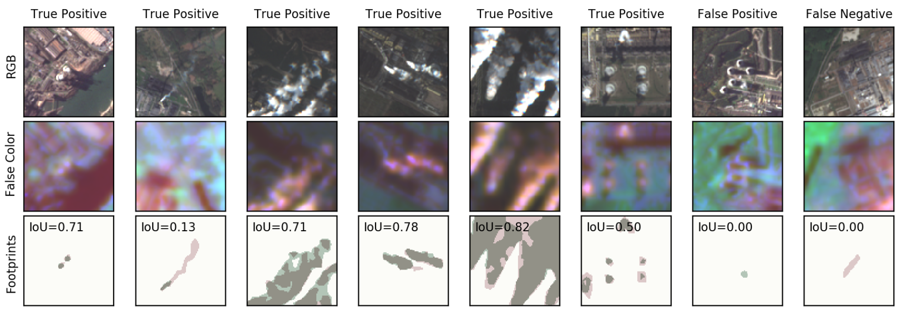

# Industrial Smoke Plume Detection

This repository contains the code base for our publication *Characterization of Industrial Smoke Plumes from
Remote Sensing Data*, presented at the *Tackling Climate Change with Machine
 Learning* workshop at NeurIPS 2020.

 
## About this Project

The major driver of global warming has been identified as the anthropogenic release
of greenhouse gas (GHG) emissions from industrial activities. The quantitative
monitoring of these emissions is mandatory to fully understand their effect on the
Earth’s climate and to enforce emission regulations on a large scale. In this work,
we investigate the possibility to detect and quantify industrial smoke plumes from
globally and freely available multiband image data from ESA’s Sentinel-2 satellites.
Using a modified ResNet-50, we can detect smoke plumes of different sizes with
an accuracy of 94.3%. The model correctly ignores natural clouds and focuses on
those imaging channels that are related to the spectral absorption from aerosols and
water vapor, enabling the localization of smoke. We exploit this localization ability
and train a U-Net segmentation model on a labeled subsample of our data, resulting
in an Intersection-over-Union (IoU) metric of 0.608 and an overall accuracy for
the detection of any smoke plume of 94.0%; on average, our model can reproduce
the area covered by smoke in an image to within 5.6%. The performance of our
model is mostly limited by occasional confusion with surface objects, the inability
to identify semi-transparent smoke, and human limitations to properly identify
smoke based on RGB-only images. Nevertheless, our results enable us to reliably
detect and qualitatively estimate the level of smoke activity in order to monitor
activity in industrial plants across the globe. Our data set and code base are publicly
available.

The full publication is available on arxiv.

The data set is available on [zenodo](http://doi.org/10.5281/zenodo.4250706).

## Content

`classification/`: 4-channel ResNet-50 classifier code, training and evaluation routines
`segmentation/`: 4-channel U-Net segmentation model code, training and evaluation routines
`deprecated/`: Original 12-channel model scripts (kept for reference)
`docs/`: Architecture documentation and slides outline
`assets/`: Example images
`scripts/`: Dataset preparation utilities

 
## How to Use

**1. Install the package**

    pip install -e .

**2. Download and prepare the data**

Download the [dataset](http://doi.org/10.5281/zenodo.4250706) and decompress
it. Run the preparation script to create train/val/test splits:

    python scripts/prepare_dataset.py --source /path/to/4250706 --output ../dataset_prepared

By default, the code expects `dataset_prepared/` to be a sibling of this
repository. Override with the `SMOKEDET_DATA_ROOT` environment variable if
your data lives elsewhere.

**3. Train a model**

    python -m smoke_detection.classification.train
    python -m smoke_detection.segmentation.train

Optional arguments:

* `-bs <int>` batch size
* `-ep <int>` number of training epochs
* `-lr <float>` starting learning rate
* `-mo <float>` momentum

**4. Evaluate**

    python -m smoke_detection.classification.eval
    python -m smoke_detection.segmentation.eval
 
 
## Acknowledgements

If you use this code for your own project, please cite the following
conference contribution:

    Mommert, M., Sigel, M., Neuhausler, M., Scheibenreif, L., Borth, D.,
    "Characterization of Industrial Smoke Plumes from Remote Sensing Data",
    Tackling Climate Change with Machine Learning Workshop,
    NeurIPS 2020.
